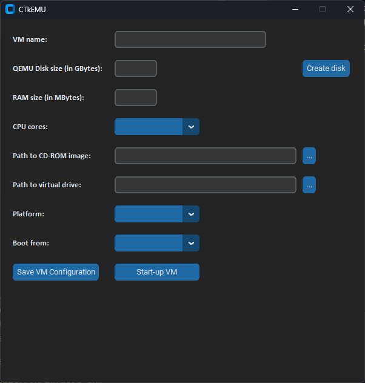
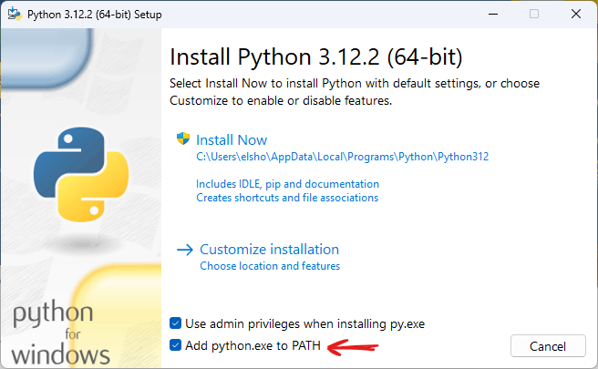
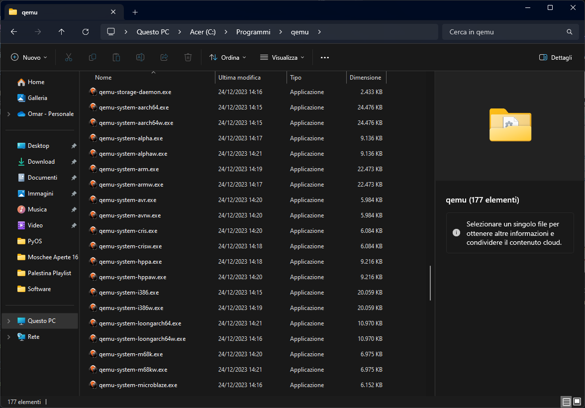
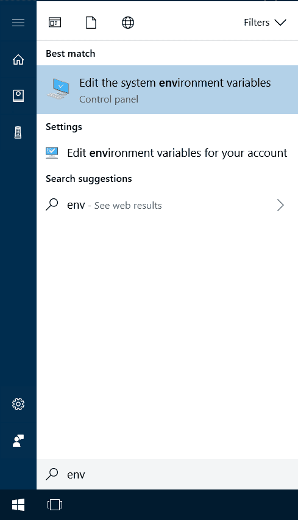
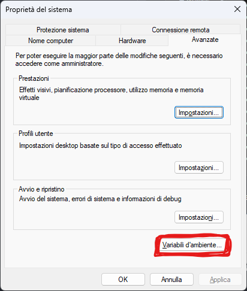
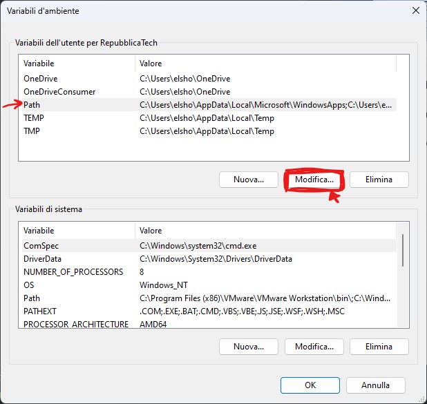
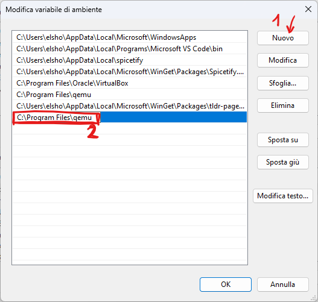

# CTkEMU: a GUI frontend for QEMU written in Python with Customtkinter

Did you ever think of the possibility to have a graphical interface for QEMU like Virt-manager? I tried many of them, but they were either outdated or they simply wouldn't work.

CTkEMU is a modern approach that uses Python with Customtkinter to easily launch QEMU VMs with a modern GUI:

Remember: This software is still not feature complete, but it's already fine for basic use.

# Installation instructions

Make sure you downloaded both `CTkEMU.py` and `requirements.txt` from the Releases page.

## 1. Requirements
Download [QEMU](https://www.qemu.org/) and [Python](https://www.python.org/downloads/) from their official website.

NOTE: when installing Python, make sure to add it to the PATH by selecting this checkbox:

# 1.1 FOR WINDOWS USERS ONLY:

After installing Python and QEMU, we need to add QEMU to the PATH variable.
Head out to the QEMU installation folder (usually it's in C:\Program Files\qemu) and copy the folder's path to the clipboard:

On the Windows' search bar, type 'path' and click on "Edit the system environment variables":

Click on "Environment variables":

Now, click on *Path* and then *Edit*:

And lastly, click on *Add* and paste the QEMU program path:

## NOTE: make sure that at the end of the text ther shouldn't be any  slashes (e.g. `C:\Programs Files\qemu` not `C:\Programs Files\qemu\`)

Finally, click OK and close all these windows.
It's recommended to restart your PC, but the PATH should be already set up.

# 2. Installing required packages

It shouldn't be hard, open a terminal window and type:

    pip install -r <drag requirements.txt here>

This will install all required Python packages and dependencies for CTkEMU.

*You now can delete the requirements.txt file since it's not needed anymore.*

This is it! You can finally enjoy launching QEMU VMs simply by double-clicking `CTkEMU.py`.